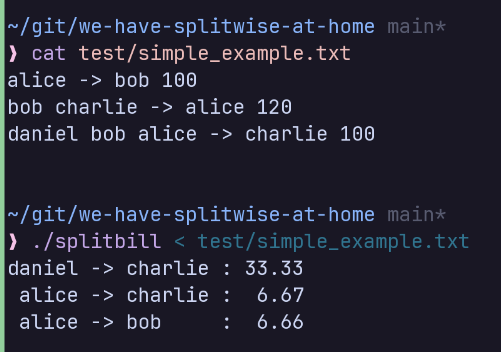

# Splitwise at home: Splitbill CLI

This is a simple CLI program, meant to be a quick resolver to simplify settlement when splitting bills. 
If you know about Splitwise, this has similar utility. You put in a bunch of bills definition and the program will
figure out a good way for the bill settlement.

## Why not Splitwise?

Splitwise requires *everyone* involved to have an account.
Not everyone wants to go through the hassle of setting it up, especially when it's a one-time settlement.

## Screenshots



## Compiling the program

Two versions are available: **C++** and **Jai**. They have identical functionality.

| Language | Requirement          | Compile Command                              |
|----------|----------------------|----------------------------------------------|
| C++      | C++11 compiler       | `g++ splitbill.cc -o splitbill -std=c++11 -O2` |
| Jai      | Jai compiler (beta)  | `jai splitbill.jai`                          |


## Usage

Run the compiled binary and input your bills. Each bill follows this format:

```
<participant_1> <participant_2> ... <participant_N> -> <payer> <amount>
```

- **`<payer>`** pays the total **`<amount>`**
- The bill is split equally among all participants on the left of `->`
- Each participant owes `<amount> / N` to the payer

#### Example Input

```
# Alice owes Bob $100
alice -> bob 100

# Bob and Charlie each owe Alice $50 (100 / 2 people)
bob charlie -> alice 100

# Alice, Bob, and Charlie each owe Daniel $25 (100 / 4 people, Daniel included)
alice bob charlie daniel -> daniel 100

# Invalid lines are ignored (useful for comments!)
# Multi-line bills are NOT supported

# When done, press Ctrl+D (Linux/Mac) or Ctrl+Z (Windows) to finish input
```

#### Example Output

```
  alice -> bob    : 25.00
charlie -> daniel : 75.00
```

This means:
- Alice pays Bob **$25**
- Charlie pays Daniel **$75**
